```{r setup, include = FALSE}
library(tidyverse)
library(gganimate)
library(RColorBrewer)
library(knitr)
library(ape)
```

<!-- adding bold and italic options -->
<style>
em {
  font-style: italic
}
strong {
  font-weight: bold;
}
</style>

## Phylogenetics of dispersal

- Population trees
- The process of dispersal
- Examples
- Viral pandemics

--- .class #id

## Essential reading

```{r, out.width = "100%", dpi = 300, echo = FALSE, fig.align='center'}
include_graphics("./assets/img/Baldauf - 2003 - Phylogeny for the faint of heart A tutorial.pdf")
```

--- .segue .dark 

## We can calculate phylogenies of different things...

--- .class bg:white

## Species trees

- These are phylogenies of species
- Each tip is a different, reproductively isolated species
- Can be inferred from a variety of data types

```{r, out.width = "40%", fig.width = 3, fig.height = 3, dpi = 600, fig.align = "center", echo = FALSE}

my.tree1 <- read.tree(text="((((human,chimp),(cat,dog)),(snake,lizard)),fish);")
par(mar=c(1,1,1,1))
plot(my.tree1)
```

--- .class bg:white

## Gene trees

- These are phylogenies of individual loci (e.g. a gene)
- Or related sets of loci (e.g. multigene families)
- Each tip is a different allele (i.e. a gene variant)

```{r, out.width = "60%", fig.width = 5, fig.height = 3, dpi = 600, fig.align = "center", echo = FALSE}

my.tree2 <- read.tree(text="(((myoglobin_chimp,myoglobin_human),myoglobin_mouse),((haemoglobin_chimp,haemoglobin_human),haemoglobin_mouse));")
par(mar=c(1,1,1,1))
plot(my.tree2)
```

--- .class bg:white

## Population-level trees

- Each tip is an individual
- Each node is their most recent ancestor (coalescence event)
- Shows the relationships of individuals and populations

```{r, out.width = "60%", fig.width = 5, fig.height = 3, dpi = 600, fig.align = "center", echo = FALSE}

my.tree3 <- read.tree(text="((((individual1,individual2),individual3),((individual4,individual5),individual6)),individual7);")
par(mar=c(1,1,1,1))
plot(my.tree3)
```

--- .segue .dark 

## How does that work?

--- .class bg:white

```{r, out.width = "95%", dpi = 300, echo = FALSE, fig.align='center'}
include_graphics("./assets/img/mtDNA_tree.svg")
```

--- .class bg:white

## Calculating population-level trees

### We'll think about mitochondrial haplotypes (diploid loci 2x more complex)

- Sequence variation provides phylogenetic information
- Similar sequences are more closely related
- Branch lengths are (loosely) proportional to sequence divergence
- Coalescence times also depend on population size
- Described by **coalescent theory**

```{r, out.width = "50%", fig.width = 4, fig.height = 2, dpi = 600, fig.align = "center", echo = FALSE}

my.tree3 <- read.tree(text="((((HapA,HapA),HapC),((HapD,HapD),HapE)),HapF);")
par(mar=c(1,1,1,1), xpd=TRUE)
plot(my.tree3)
```

--- .class bg:white

## Human mitochondrial phylogeny

*Rishishwar L, Jordan IK. BMC Genomics. 2017;18:140. CC BY 4.0*

```{r, out.width = "65%", dpi = 300, echo = FALSE, fig.align='center'}
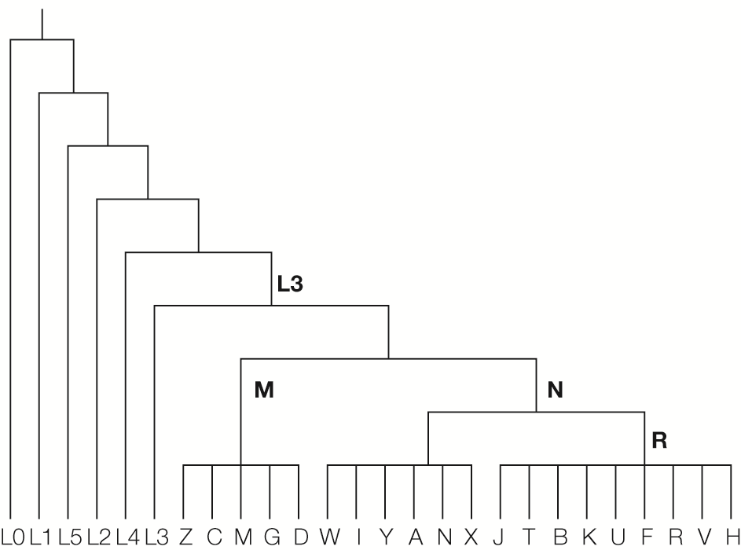
```

--- .class #id

## PhyloTree.org visualisation

<iframe src = 'https://www.phylotree.org/tree/index.htm' height='600px'></iframe>

--- .class bg:white

## Geographic occurrence

```{r, out.width = "95%", dpi = 300, echo = FALSE, fig.align='center'}
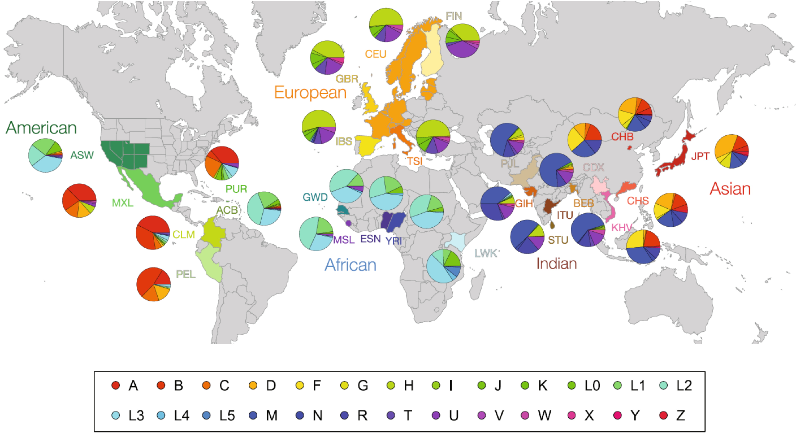
```

*Rishishwar L, Jordan IK. BMC Genomics. 2017;18:140. CC BY 4.0*

--- .class bg:white

```{r, out.width = "95%", dpi = 300, echo = FALSE, fig.align='center'}
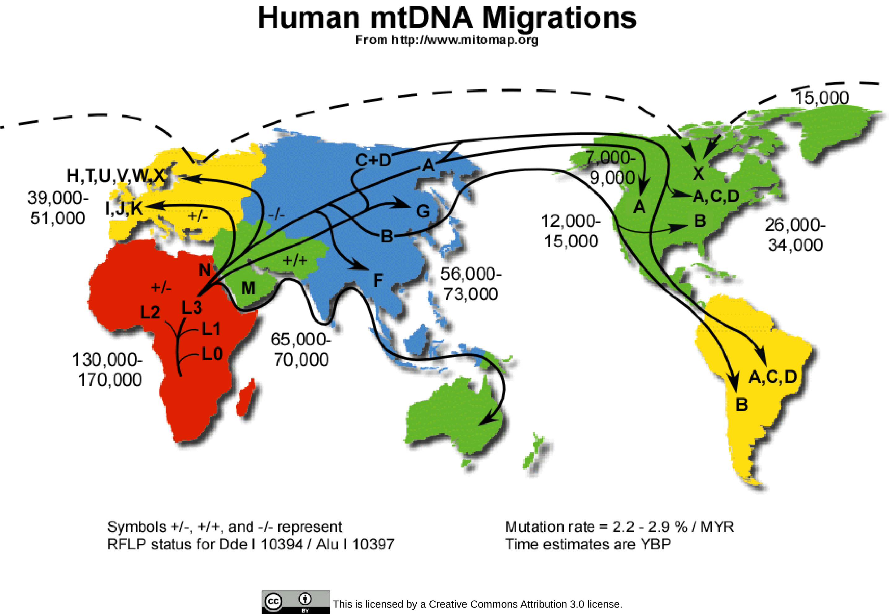
```

--- .class #id

## PIECE TO CAMERA

--- &twocol bg:white

## The dispersal process

- Imagine 2 Islands: A and B
- B is colonised from A by a single individual
- This transports one lineage from A to the new island B
- Individuals from B are nested within the A clade

*** =left

```{r, out.width = "90%", fig.width = 4, fig.height = 3, dpi = 600, fig.align = "center", echo = FALSE}

my.tree4 <- read.tree(text="((((A,A),A),((A,B),A)),A);")
par(mar=c(1,1,1,1), xpd=TRUE)
plot(my.tree4, edge.width=3, cex=2, tip.color=c("black", "black", "black", "black", "red", "black", "black"))

```

*** =right

```{r, out.width = "40%", dpi = 300, echo = FALSE, fig.align='center'}
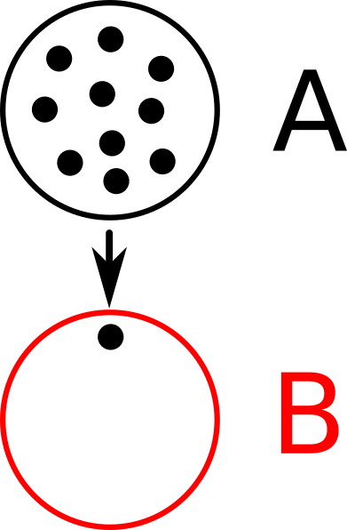
```

--- &twocol bg:white

## Subsequent expansion

- The newly introduced B population expands
- All individuals are descendants of the founding lineage
- The B clade is nested within A
- A individuals are **paraphyletic** with respect to B

*** =left

```{r, out.width = "90%", fig.width = 4, fig.height = 3.5, dpi = 600, fig.align = "center", echo = FALSE}

my.tree4 <- read.tree(text="((((A,A),A),((A,(B,(B,(B,B)))),A)),A);")
par(mar=c(1,1,1,1), xpd=TRUE)
plot(my.tree4, edge.width=3, cex=2, tip.color=c("black", "black", "black", "black", "red", "red", "red", "red", "black", "black"))

```

*** =right

```{r, out.width = "40%", dpi = 300, echo = FALSE, fig.align='center'}

```

--- &twocol

## Examples: Golden Lancehead

*** =left

```{r, out.width = "70%", dpi = 300, echo = FALSE, fig.align='right'}
include_graphics("./assets/img/Ilha_da_Queimada_Grande_-_Itanhaém3.jpg")
```
*Queimada Grande, Prefeitura Municipal de Itanhaém, CC BY 2.5*

*** =right

```{r, out.width = "70%", dpi = 300, echo = FALSE, fig.align='left'}
include_graphics("./assets/img/Bothrops_insularis.jpg")
```
*Bothrops insularis, Nayeryouakim, CC BY 4.0*

```{r, out.width = "70%", dpi = 300, echo = FALSE, fig.align='left'}
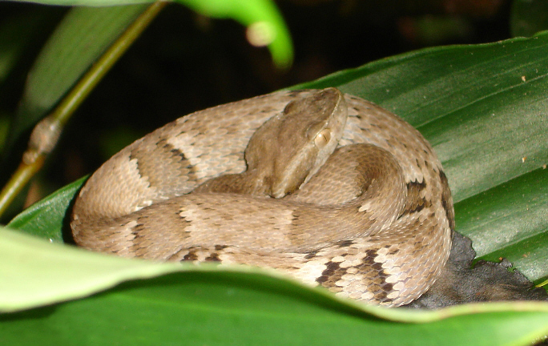
```
*Bothrops jararaca, Fernando Tatagiba, CC BY 3.0*

--- &twocol bg:white

## Examples: Golden Lancehead

*** =left

```{r, out.width = "90%", fig.width = 4, fig.height = 4, dpi = 600, fig.align = "center", echo = FALSE}

my.tree4 <- read.tree(text="(((((jararaca,jararaca),jararaca)),(((jararaca,jararaca),insularis)),(jararaca,jararaca)),jararaca);")
par(mar=c(1,1,1,1), xpd=TRUE)
plot(my.tree4, edge.width=3, cex=1.5, tip.color=c("black", "black", "black", "black", "black", "red", "black", "black", "black", "black"))

```

*Wüster et al. Journal of Zoology 266.1 (2005): 1-10*

*** =right

```{r, out.width = "70%", dpi = 300, echo = FALSE, fig.align='left'}
include_graphics("./assets/img/Bothrops_insularis.jpg")
```
*Bothrops insularis, Nayeryouakim, CC BY 4.0*

```{r, out.width = "70%", dpi = 300, echo = FALSE, fig.align='left'}

```
*Bothrops jararaca, Fernando Tatagiba, CC BY 3.0*

--- &twocol

## Examples: Barbados anoles

*** =right

```{r, out.width = "70%", dpi = 300, echo = FALSE, fig.align='center'}
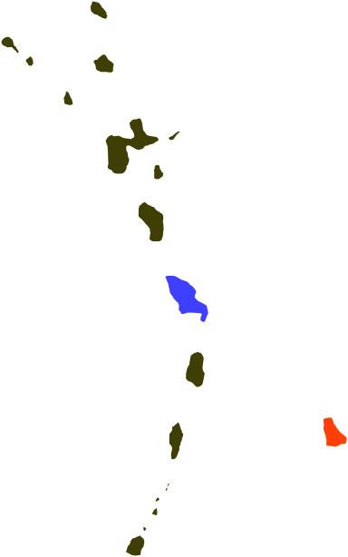
```

*** =left

```{r, out.width = "75%", dpi = 300, echo = FALSE, fig.align='center'}
include_graphics("./assets/img/Martinique's_anole.png")
```
*Anolis roquet, Adamhesim, CC BY 4.0*

```{r, out.width = "40%", dpi = 300, echo = FALSE, fig.align='center'}
include_graphics("./assets/img/Anolis_extremus-m04.jpg")
```
*Anolis extremus, Postdlf, CC BY SA-3.0*

--- &twocol bg:white

## Examples: Barbados anoles

*** =right

```{r, out.width = "70%", dpi = 300, echo = FALSE, fig.align='center'}

```

*** =left

```{r, out.width = "45%", dpi = 300, echo = FALSE, fig.align='center'}
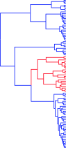
```

*Thorpe et al. Mol phylogenet evol 127 (2018): 682-695.*

--- &twocol bg:white

## Complicating factors

- So far we have considered a **small** and **genetically similar** founding population
- What happens if the founding population is large and genetically diverse?

>- This can "look" like multiple colonisation events
>- And even make the direction of colonisation uncertain

*** =left

```{r, out.width = "90%", fig.width = 4, fig.height = 3, dpi = 600, fig.align = "center", echo = FALSE}

my.tree4 <- read.tree(text="((((B,A),A),((A,B),A)),(B,A));")
par(mar=c(1,1,1,1), xpd=TRUE)
plot(my.tree4, edge.width=3, cex=2, tip.color=c("red", "black", "black", "black", "red", "black", "red", "black"))

```

*** =right

```{r, out.width = "40%", dpi = 300, echo = FALSE, fig.align='center'}
include_graphics("./assets/img/island_dispersal3.png")
```

--- .segue .dark 

## So what about viruses?

--- &twocol bg:white

## Racoon rabies in Ontario

*Nadin-Davis et al. Virus Research 232 (2017): 123-133. CC BY 4.0*

*** =left

```{r, out.width = "100%", dpi = 300, echo = FALSE, fig.align='center'}
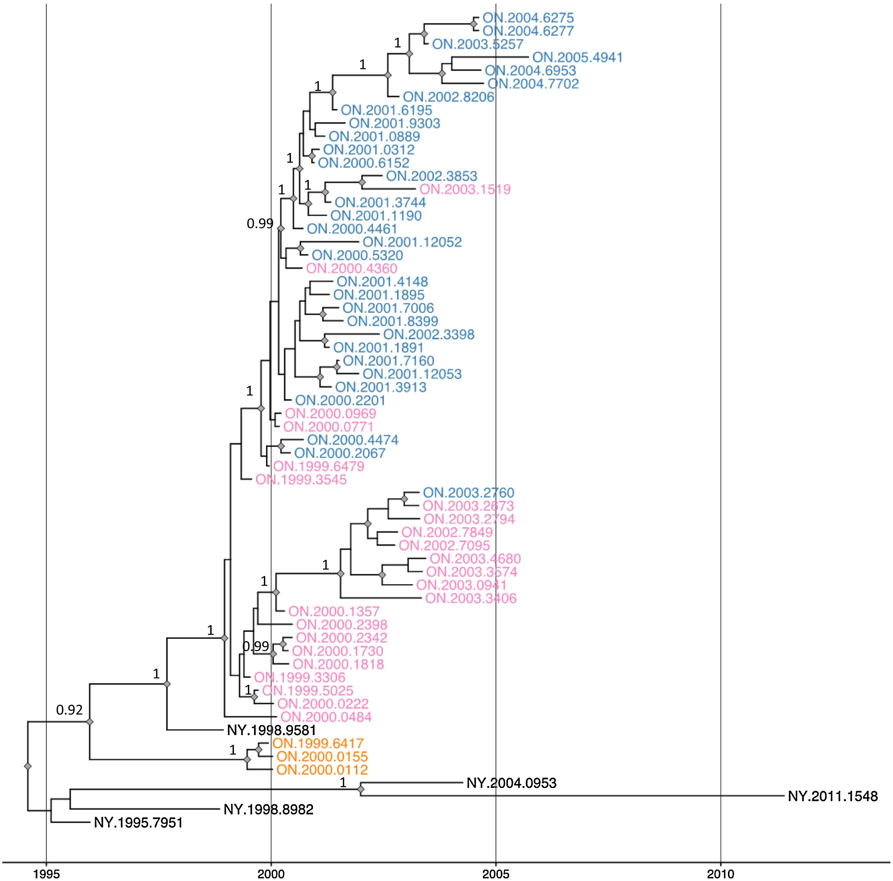
```

*** =right

```{r, out.width = "100%", dpi = 300, echo = FALSE, fig.align='center'}
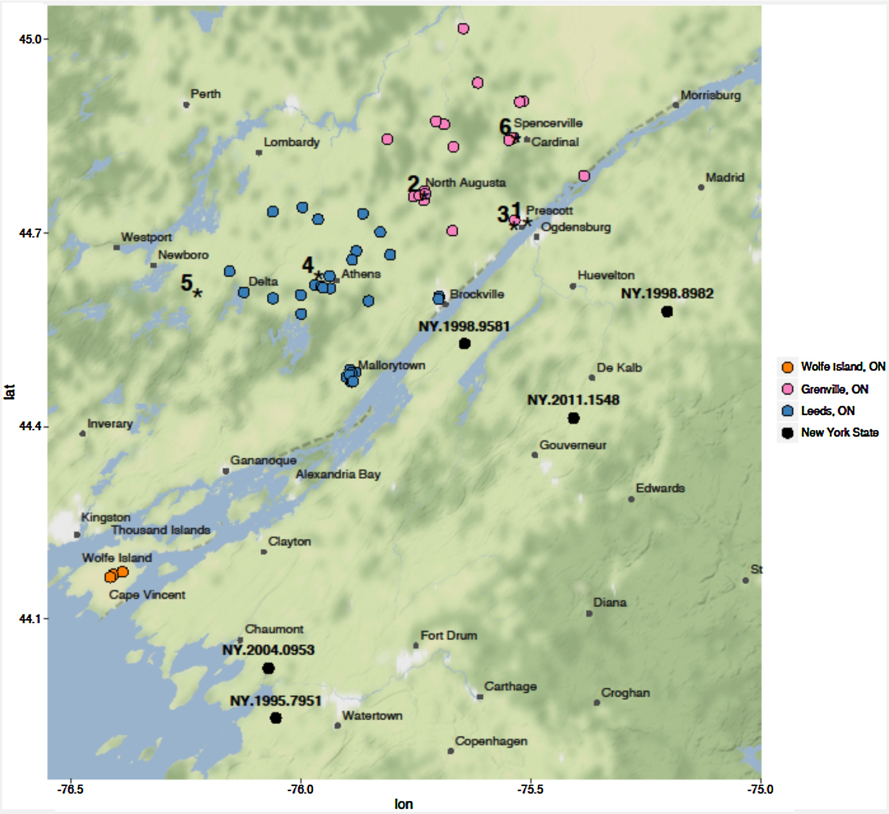
```

--- .class bg:white

## Avian influenza H5N1 in Asia

*Tian et al. Proceedings of the National Academy of Sciences 112.1 (2015): 172-177.*

```{r, out.width = "65%", dpi = 300, echo = FALSE, fig.align='center'}
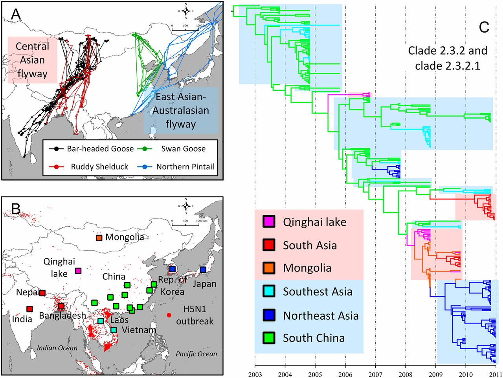
```

--- .class bg:white

## Ebola virus in West Africa

*Suchard, et al. Virus evolution 4.1 (2018): vey016.*

```{r, out.width = "85%", dpi = 300, echo = FALSE, fig.align='center'}
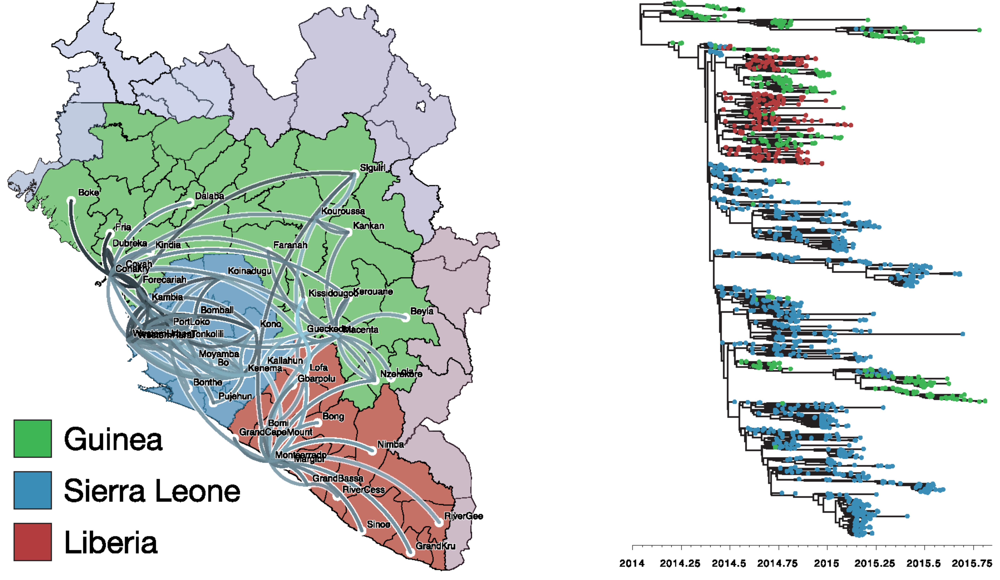
```

--- .class #id

## Phylogenetics of dispersal

- Population trees
- The process of dispersal
- Examples
- Viral pandemics

--- &thankyou

## Next time

**Bayesian phylogenetics**

