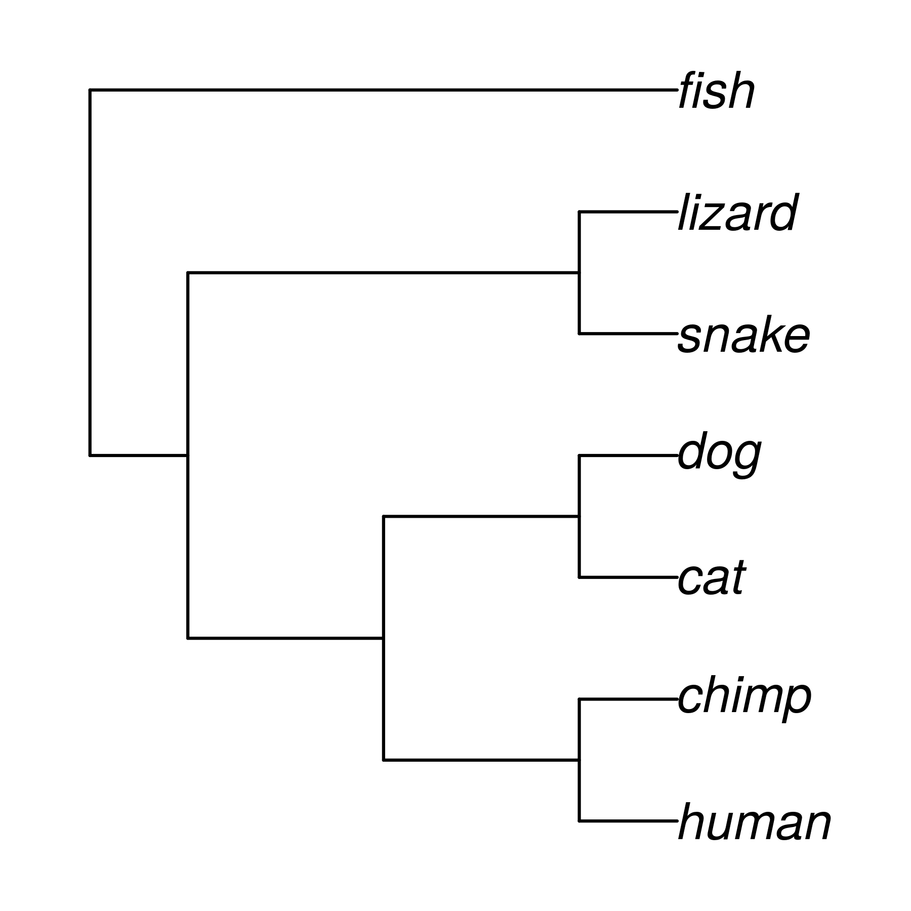
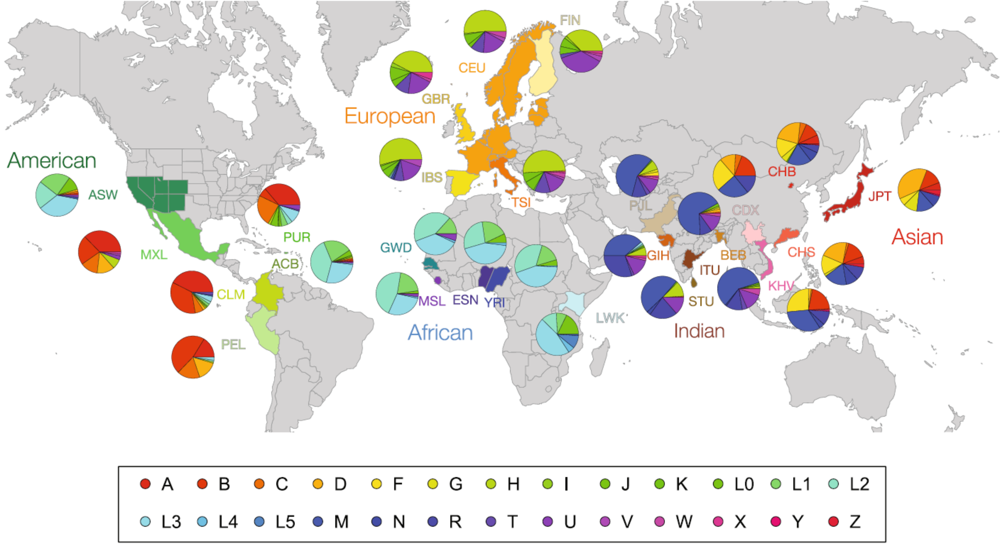
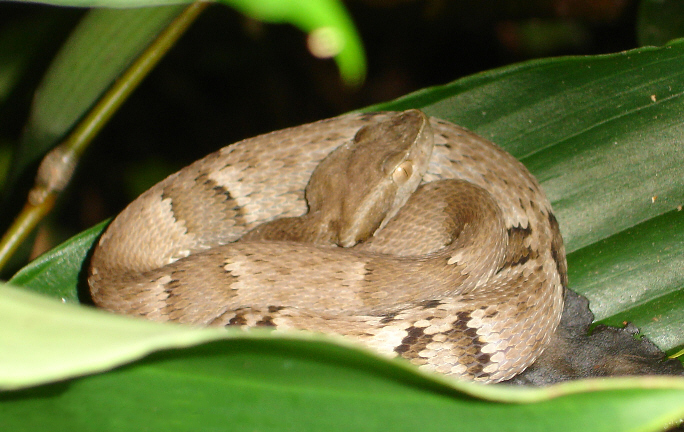
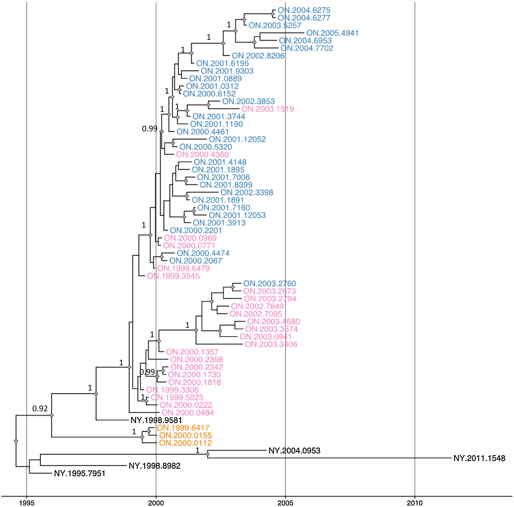

<!-- adding bold and italic options -->

## Phylogenetics of dispersal

- Population trees
- The process of dispersal
- Examples
- Viral pandemics

--- .class #id

## Essential reading

<embed src="./assets/img/Baldauf - 2003 - Phylogeny for the faint of heart A tutorial.pdf" title="plot of chunk unnamed-chunk-1" alt="plot of chunk unnamed-chunk-1" width="100%" style="display: block; margin: auto;" type="application/pdf" />

--- .segue .dark 

## We can calculate phylogenies of different things...

--- .class bg:white

## Species trees

- These are phylogenies of species
- Each tip is a different, reproductively isolated species
- Can be inferred from a variety of data types

--- .class bg:white

## Gene trees

- These are phylogenies of individual loci (e.g. a gene)
- Or related sets of loci (e.g. multigene families)
- Each tip is a different allele (i.e. a gene variant)

--- .class bg:white

## Population-level trees

- Each tip is an individual
- Each node is their most recent ancestor (coalescence event)
- Shows the relationships of individuals and populations

--- .segue .dark 

## How does that work?

--- .class bg:white

--- .class bg:white

## Calculating population-level trees

### We'll think about mitochondrial haplotypes (diploid loci 2x more complex)

- Sequence variation provides phylogenetic information
- Similar sequences are more closely related
- Branch lengths are (loosely) proportional to sequence divergence
- Coalescence times also depend on population size
- Described by **coalescent theory**

--- .class bg:white

## Human mitochondrial phylogeny

*Rishishwar L, Jordan IK. BMC Genomics. 2017;18:140. CC BY 4.0*

--- .class #id

## PhyloTree.org visualisation

<iframe src = 'https://www.phylotree.org/tree/index.htm' height='600px'></iframe>

--- .class bg:white

## Geographic occurrence

*Rishishwar L, Jordan IK. BMC Genomics. 2017;18:140. CC BY 4.0*

--- .class bg:white

--- .class #id

## PIECE TO CAMERA

--- &twocol bg:white

## The dispersal process

- Imagine 2 Islands: A and B
- B is colonised from A by a single individual
- This transports one lineage from A to the new island B
- Individuals from B are nested within the A clade

*** =left

*** =right

--- &twocol bg:white

## Subsequent expansion

- The newly introduced B population expands
- All individuals are descendants of the founding lineage
- The B clade is nested within A
- A individuals are **paraphyletic** with respect to B

*** =left

*** =right

--- &twocol

## Examples: Golden Lancehead

*** =left

*Queimada Grande, Prefeitura Municipal de Itanhaém, CC BY 2.5*

*** =right

*Bothrops insularis, Nayeryouakim, CC BY 4.0*

*Bothrops jararaca, Fernando Tatagiba, CC BY 3.0*

--- &twocol bg:white

## Examples: Golden Lancehead

*** =left

*Wüster et al. Journal of Zoology 266.1 (2005): 1-10*

*** =right

*Bothrops insularis, Nayeryouakim, CC BY 4.0*

*Bothrops jararaca, Fernando Tatagiba, CC BY 3.0*

--- &twocol

## Examples: Barbados anoles

*** =right

*** =left

*Anolis roquet, Adamhesim, CC BY 4.0*

*Anolis extremus, Postdlf, CC BY SA-3.0*

--- &twocol bg:white

## Examples: Barbados anoles

*** =right

*** =left

*Thorpe et al. Mol phylogenet evol 127 (2018): 682-695.*

--- &twocol bg:white

## Complicating factors

- So far we have considered a **small** and **genetically similar** founding population
- What happens if the founding population is large and genetically diverse?

>- This can "look" like multiple colonisation events
>- And even make the direction of colonisation uncertain

*** =left

*** =right

--- .segue .dark 

## So what about viruses?

--- &twocol bg:white

## Racoon rabies in Ontario

*Nadin-Davis et al. Virus Research 232 (2017): 123-133. CC BY 4.0*

*** =left

*** =right

--- .class bg:white

## Avian influenza H5N1 in Asia

*Tian et al. Proceedings of the National Academy of Sciences 112.1 (2015): 172-177.*

--- .class bg:white

## Ebola virus in West Africa

*Suchard, et al. Virus evolution 4.1 (2018): vey016.*

--- .class #id

## Phylogenetics of dispersal

- Population trees
- The process of dispersal
- Examples
- Viral pandemics

--- &thankyou

## Next time

**Bayesian phylogenetics**

